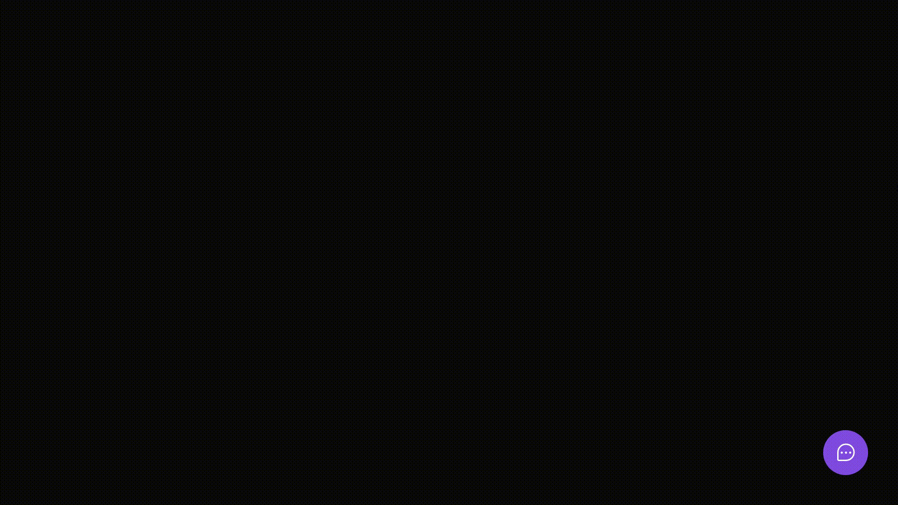

<h1 align="center">
   
</h1>

<p align="center">
  
  
  
  
  
</p>


## 🏄 Sobre o Projeto

Este projeto foi feito juntamente com a equipe da [Rocketseat](https://rocketseat.com.br) no evento Next Level Week Heat, que esta na sua 8ª edição. Nela desenvolvemos um widget para ser instalado e utilizado em diferentes aplicações, com o objetivo de coletar feedbacks dos usuários e envia-los por email ao administrador da aplicação.

No back end utilizamos NodeJS, sempre focando nas melhores praticas quanto a TDD e DDD. Podemos também explorar as funcionálidades do Prisma para lidar com o banco de dados, e gerar migrations para mantes sempre atualizadas as informações das tabelas de forma versionada e organizada.

No frontend utilizamos Vite para criar a aplicação, e o framework ReactJS foi o escolhido como base. Para mim o Vite foi a maior descoberta deste NLW, pois não conhecia essa ferramenta. Achei incrível! Além disso, utilizamos o TailwindCSS para estilização, outra ferramenta que nunca havia utilizado e que achei muito prática e com funcionalidades excelentes.

A parte mobile foi feita com ReactNative, o que nos permitiu aproveitar muitos conhecimentos, visto que é um framework que utiliza dos conceitos do ReactJS como sua base, tornando a curva de aprendizado mais curta.

E a cereja do bolo: deploy automatizado do frontend e do backente, utilizando Vercel e Railway, respectivamente. Foi incrível!

As aulas da trilha impulse foram ministradas por [Diego Fernandes](https://github.com/diego3g) e [Rodrigo](https://github.com/rodrigorgtic). 🚀

### 🔎 Demonstração



### 📙 Rodando o Backend

```bash
# Clone este repositório
$ git clone https://github.com/dev-mauricioAB/nlw-return

# Navegue para a pasta
$ cd backend

# Execute as migrations
$ yarn prisma migrate dev

# Instale as dependências
$ yarn

# Execute a aplicação
$ yarn dev
```

### 📗 Rodando o Frontend (web)

```bash
# Navegue para a pasta
$ cd web

# Instale as dependências
$ yarn

# Execute a aplicação
$ yarn dev
```

### 📘 Rodando o Mobile

```bash
# Navegue para a pasta
$ cd mobile

# Instale as dependências
$ yarn

# Execute a aplicação
$ yarn start
```

### :hammer_and_wrench: Tecnologias
<div style="display: flex">
  <a href="https://reactnative.dev/"> React Native</a><br/>

  <a href="https://reactjs.org/"> React</a><br/>
  
  <a href="https://www.typescriptlang.org/"> Typescript</a><br/>
  
  <a href="https://reactjs.org/"> HTML</a><br/>
  
  <a href="https://sass-lang.com/"> TailwindCSS</a><br/>
  
  <a href="https://nodejs.org/"> Node</a><br/>

  <a href="https://prisma.io/"> Prisma</a><br/>
  
  <a href="https://jest.io/"> Jest</a><br/>

  <a href="https://phosphoricons.com/"> Phosphor Icons</a><br/>

  <a href="https://vitejs.dev/"> Vite JS</a><br/>
</div>

### 📕 Bibliotecas

Esse projeto foi utilizou das seguintes lib:

- Prisma
- TS
- Axios
- Express
- react-icons
- yup
- styled-components

### 📙 Arquitetura do Projeto

Para uma melhorar estrutura de projetos utilizamos das seguintes fundamentos:

- DDD
- SOLID

###  📘 Padrão de Código

Para padronizar a escrita do código, utilizamos as seguinte ferramentas:

- Eslint
- Prettier
- EditorConfig


### 📝 Licença

Esse projeto está sob a licença MIT.
